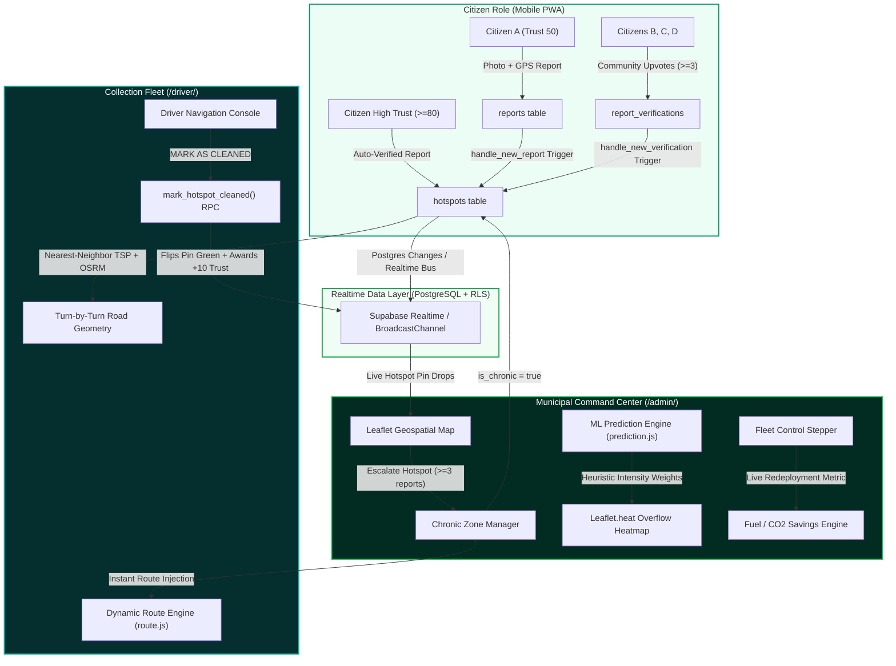

# EcoRoute — Smart Municipal Waste Management & Predictive Fleet Routing

[](https://sih.gov.in/)
[](https://sih.gov.in/)
[](https://developer.mozilla.org/en-US/docs/Web/Progressive_web_apps)
[](#tech-stack)

> **Smart India Hackathon 2026** · *Next-Generation Municipal Solid Waste (MSW) Optimization Platform*  
> Turning passive waste reporting into proactive, predictive fleet dispatching and closed-loop civic accountability.

---

## 📌 Executive Summary & Problem Statement

Urban India generates over **150,000 tonnes of municipal solid waste (MSW) daily**, of which an estimated **30–45% remains uncollected or ends up in chronic informal dumpsites**. Municipal corporations face three systemic bottlenecks:

1. **Static, Blind Route Schedules:** Collection trucks follow fixed historical routes regardless of whether bins are overflowing or empty, wasting up to 35% of diesel and fleet time in low-yield areas.
2. **Citizen Fatigue & Fake/Duplicate Reports:** Traditional complaint portals suffer from low verification rates, spam, and no real-time transparency into when dumps are cleared.
3. **Chronic Dump Zone Blindspots:** Locations that repeatedly accumulate waste after clearing (informal transfer points, vegetable markets, transit alleys) are never systematically tracked or escalated to high-frequency dispatch schedules.

### The EcoRoute Solution

**EcoRoute** bridges citizens, municipal drivers, and city administrators into a synchronized, closed-loop telemetry and routing ecosystem:

- 📱 **Citizen Web App (PWA):** Geotagged photo reports with instant AI segregation advisory, community verification upvoting, and a gamified **Trust Score (0–100)** that fast-tracks credible citizens directly to driver routes.
- 🚛 **Driver Route Console (PWA):** High-contrast navigation console powered by **Nearest-Neighbor TSP** and **OSRM real-road routing**, featuring one-tap cleanup logging with offline-first synchronization.
- 🗺️ **Admin Municipal Command Center:** Real-time citywide geospatial dashboard featuring **Explainable AI Garbage Prediction Heatmaps**, dynamic **Fleet Zone Truck Redeployment**, and an interactive **Chronic Dump Zone Manager** that pushes updates live without page reloads.

---

## 🏛️ System Architecture



---

## 🚀 Key Innovation Highlights

### 1. Gamified Citizen Trust Engine & Fraud Prevention
- Citizens start at **Trust Score 50**.
- Reports from normal citizens require **3 community upvotes** before driver dispatch.
- Citizens with **Trust Score ≥ 80** bypass upvotes entirely; their reports immediately spawn verified collection waypoints.
- Whenever a driver taps **MARK AS CLEANED**, the original citizen reporter is automatically awarded **+10 Trust Points** via a secure database trigger, creating positive civic reinforcement.

### 2. Explainable AI Garbage Prediction Heatmap
Unlike opaque black-box models, `admin/prediction.js` computes a transparent, normalized overflow risk score $S \in [0, 1]$ per city hotspot:

$$S = w_f \cdot \min\left(\frac{C_r}{10}, 1\right) + w_t \cdot \min\left(\frac{\Delta t}{7}, 1\right) + w_c \cdot I_{\text{chronic}} + w_m \cdot (M_{\text{day}} - 1)$$

- **$C_r$:** Historical citizen report frequency ($w_f = 0.35$).
- **$\Delta t$:** Days elapsed since last municipal clearing ($w_t = 0.30$).
- **$I_{\text{chronic}}$:** Chronic dump designation flag ($w_c = 0.25$).
- **$M_{\text{day}}$:** Day-of-week and market activity multiplier ($w_m = 0.10$).

### 3. Dynamic TSP Routing & OSRM Road Geometry
- Rather than forcing drivers along rigid paths, `driver/route.js` runs a **Nearest-Neighbor Traveling Salesperson Problem (TSP)** heuristic from the truck's live GPS coordinates.
- Fetches real road routing polyline vectors from the **OSRM (Open Source Routing Machine)** public engine with fallback to geodesic navigation.
- If an admin marks a candidate zone as **Chronic**, it drops into the driver's active route within **1.2 seconds** via the realtime broadcast pipeline without refreshing the console.

### 4. Fleet Redeployment & Environmental Gains Calculator
- Divides Delhi into 5 strategic zones (Central, North, South, West, East).
- Allows administrators to dynamically downscale vehicle allocations in low-risk zones and redeploy them to high-density zones.
- Real-time impact indicators quantify **Litres of Diesel Saved**, **Collection Hours Saved**, and **kg of CO₂ Avoided** using official Ministry of Housing and Urban Affairs (MoHUA) benchmarks.

---

## 🛠️ Tech Stack

| Component | Technology | Rationale |
|:---|:---|:---|
| **Core Architecture** | Vanilla HTML5, CSS3, ES6 Modules | 100% dependency-free, zero build step, instant load time, minimal memory footprint. |
| **Geospatial Mapping** | [Leaflet.js](https://leafletjs.com/) v1.9.4 & [Leaflet.heat](https://github.com/Leaflet/Leaflet.heat) | High-performance canvas tile rendering with Esri Dark Gray Base vector basemaps. |
| **Road Routing** | [OSRM Project API](https://project-osrm.org/) | Real-world driving turn-by-turn geometry and distance matrices. |
| **Database & Auth** | [Supabase](https://supabase.com/) (PostgreSQL 15) | Row-Level Security (RLS), Postgres Triggers, RPC functions, and Realtime Change Publications. |
| **Local Sync Bus** | `BroadcastChannel API` + `StorageEvent` | Sub-millisecond zero-latency cross-tab communication for seamless multi-screen jury demonstrations. |
| **PWA & Offline** | Service Worker (`sw.js`) + Web App Manifest | Supports "Add to Home Screen" on Android & iOS with network-first caching and offline fallbacks. |

---

## 👥 Demo User Credentials

The platform includes pre-configured credentials representing all three municipal roles:

| Role | Email | Password | Trust Score | Default Landing |
|:---|:---|:---|:---:|:---|
| **Chief Municipal Admin** | `admin@cleangreen.in` | `demo1234` | 100 | `/admin/index.html` |
| **Fleet Driver** | `driver@cleangreen.in` | `demo1234` | 100 | `/driver/index.html` |
| **Citizen (Standard)** | `citizen1@cleangreen.in` | `demo1234` | 50 (Pending verification required) | `/citizen/index.html` |
| **Citizen (Trusted)** | `citizen2@cleangreen.in` | `demo1234` | 85 (Bypasses verification) | `/citizen/index.html` |
| **Citizen (Contributor)** | `citizen3@cleangreen.in` | `demo1234` | 65 | `/citizen/index.html` |

> 💡 **Instant Evaluation Mode:**  
> Append `?demo=1` to any URL (e.g., `http://localhost:3000/admin/index.html?demo=1`) to launch instantly with mock sessions and offline simulation active—no internet or Supabase configuration required!

---

## ⚡ Live Jury Presentation Cheatsheet (`Ctrl + Shift + D`)

To make your live hackathon demo flawless, the Admin Command Center features a **hidden Live Demo Controller**:

1. Open `/admin/index.html?demo=1` in your browser.
2. Press <kbd>Ctrl</kbd> + <kbd>Shift</kbd> + <kbd>D</kbd> (or click **Demo Controls** in the left sidebar).
3. Use the one-click simulator buttons:
   - 📢 **Simulate Citizen Report:** Drops an active waste report in Delhi, updates KPIs, and alerts open driver tabs.
   - 🚛 **Simulate Truck Movement:** Advances Truck #104 along its collection route, broadcasting moving GPS coordinates.
   - 🧹 **Simulate Driver Clean Action:** Flips the active red hotspot pin to emerald green with an expanding pulse animation and decrements remaining stops.
   - ⏱️ **Autonomous Demo Loop:** Toggles hands-free continuous simulation (triggers reports, vehicle movement, and clearing every 6 seconds).
   - 🔄 **Reset Demo Data:** Clears overrides and restores baseline seeds instantly.

---

## 💻 Local Setup & Development

### Prerequisites
- Node.js (v18+ recommended) or Python 3 for static file serving.

### Quick Start (1 Minute)

```bash
# 1. Clone the repository
git clone https://github.com/your-org/ecoroute.git
cd ecoroute

# 2. Start a local static server
npx -y serve -l 3000 .
# OR using Python:
# python -m http.server 3000

# 3. Open in your browser
# Landing & Role Chooser: http://localhost:3000/
# Admin Command Center:   http://localhost:3000/admin/index.html?demo=1
# Citizen Dashboard:       http://localhost:3000/citizen/index.html?demo=1
# Driver Route Console:   http://localhost:3000/driver/index.html?demo=1
```

### Full Supabase Database Integration (Optional)

If you wish to connect a live Supabase project instead of using the local demo mode:

1. Copy `.env.example` to `.env` or open `config.js`.
2. Set `SUPABASE_URL` and `SUPABASE_ANON_KEY`.
3. In your Supabase SQL Editor:
   - Run `sql/schema.sql` (Creates tables, triggers, RPC, RLS policies, and Realtime publications).
   - Run `sql/seed.sql` (Inserts Delhi hotspots, test users, and initial reports).
4. Create a public Storage bucket named `report-photos`.
5. Full step-by-step instructions are available in [`SETUP.md`](./SETUP.md).

---

## ☁️ Static Cloud Deployment

The EcoRoute codebase is 100% static and requires **no build step**, making it compatible with any modern CDN or static host.

### Deploy to Vercel

[](https://vercel.com/new)

1. Push your repository to GitHub or GitLab.
2. In the Vercel Dashboard, import the repository.
3. Configure settings:
   - **Framework Preset:** `Other`
   - **Root Directory:** `./`
   - **Build Command:** *(Leave empty)*
   - **Output Directory:** `./`
4. Deploy! Configuration in [`vercel.json`](./vercel.json) handles PWA headers and clean URLs automatically.

### Deploy to Netlify

[](https://app.netlify.com/start)

1. Connect your repository in Netlify.
2. Build settings:
   - **Build command:** *(Leave empty)*
   - **Publish directory:** `.`
3. Deploy! [`netlify.toml`](./netlify.toml) manages Service Worker no-cache policies and security headers.

---

## 🎯 Feature-to-SIH-Theme Mapping

| SIH 2026 Theme / Evaluation Metric | EcoRoute Implementation |
|:---|:---|
| **Clean & Green Technology** | Predictive fleet redeployment directly reduces municipal diesel consumption and CO₂ emissions. Waste segregation AI bot guides citizens toward wet/dry sorting at the source. |
| **Smart Cities & IoT Readiness** | Real-time GPS truck telemetry, automated OSRM route computation, and dynamic dispatching replace static manual rosters with automated digital governance. |
| **Civic Engagement & Swachh Bharat** | Upvoting verification loop prevents false reports; transparent trust scores empower responsible residents and reward verified cleanups. |
| **Scalability & Edge Deployment** | Pure web standards architecture (zero npm dependencies, zero build step) guarantees high performance on low-end budget smartphones and patchy mobile connections. |
| **Enterprise Security & Compliance** | PostgreSQL Row-Level Security (RLS) protects sensitive citizen data and ensures only authorized fleet drivers and admins can execute cleanup operations. |

---

## 📂 Project Directory Structure

```text
SIH2/
├── admin/                     # Admin Municipal Command Center
│   ├── index.html             # Command map, KPI bar, Chronic Zone manager, Demo controller
│   └── prediction.js          # Heuristic ML prediction scoring & fleet redeployment math
├── assets/
│   └── icons/                 # PWA icons (512x512, 192x192, maskable, SVG, favicon)
├── citizen/                   # Citizen Mobile PWA
│   └── index.html             # Geotagged reporting, camera capture, segregation bot, trust profile
├── driver/                    # Driver Route Console PWA
│   ├── index.html             # High-contrast turn-by-turn navigation & cleanup logger
│   └── route.js               # Nearest-neighbor TSP heuristic & OSRM road geometry engine
├── shared/                    # Shared design system and client libraries
│   ├── auth.js                # Role-based auth guards and session manager
│   ├── supabaseClient.js      # Supabase initialization with offline demo fallback
│   └── theme.css              # Unified CleanGreen design tokens, animations, skeleton loaders
├── sql/
│   ├── schema.sql             # PostgreSQL schema, triggers, RLS policies, RPC functions
│   └── seed.sql               # Seed dataset (15 Delhi hotspots, 25 reports, users)
├── index.html                 # Main landing page & role selector
├── manifest.json              # Web App Manifest for PWA installation
├── sw.js                      # Service Worker with network-first caching
├── vercel.json                # Vercel deployment configuration
├── netlify.toml               # Netlify deployment configuration
├── .env.example               # Environment variables template
├── SETUP.md                   # Database setup guide
└── README.md                  # Master documentation & jury guide
```

---

## ⚖️ License & Acknowledgments

- **License:** MIT License. Built for Smart India Hackathon 2026.
- **Data Sources:** Geospatial coordinate references modeled from central Delhi (NCT) municipal wards under NDMC and MCD boundaries. Emission calculation factors referenced from MoHUA and IPCC AR6 reports.
